# Testing

## Contents
* [Validation](#validation)
    * [W3C Markup Validator](#W3C-Markup-Validator)
    * [W3C CSS Validator Services](#W3C-CSS-Validator-Services)
    * [JSHint](#JSHint)
    * [Pep8 Online](#Pep8-Online)
    * [Lighthouse](#lighthouse)
* [Testing User Stories](#Testing-User-Stories)
    * [First Time User Goals](#First-Time-User-Goals)
    * [Returning User Goals](#Returning-User-Goals)
    * [Site Owner Goals](#Site-Owner-Goals)
* [Testing Features](#Testing-Features)
    * [Header](#Header)
    * [Home Page](#HOME-PAGE)
    * [Products Page](#PRODUCTS-PAGE)
    * [Product Detail Page](#PRODUCT-DETAIL-PAGE)
    * [Product Management Page](#PRODUCT-MANAGEMENT-PAGE)
    * [Profile Page](#PROFILE-PAGE)
    * [Checkout Page](#CHECKOUT-PAGE)
    * [Checkout Success Page](#CHECKOUT-SUCCESS-PAGE)
    * [Order History Page](#ORDER-HISTORY-PAGE)
    * [Sign In Page](#SIGN-IN-PAGE)
    * [Sign Up Page](#SIGN-UP-PAGE)
    * [Verify Account Page](#VERIFY-ACCOUNT-PAGE)
* [Site Responsiveness](#Site-Responsiveness)
* [User Testing](#User-Testing)
    * [Known Bugs and Issues Section](#known-bugs-and-issues)
    * [Remaining Bugs and Issues Section](#Remaining-Bugs-and-Issues)

## Validation

[W3C Markup Validator](https://validator.w3.org/), [W3C CSS Validator Services](https://jigsaw.w3.org/css-validator/),  [JSHint](https://jshint.com/) and [Pep8 Online](http://pep8online.com/) were used to validate this project's code and to make sure there were no syntax errors in the project.

[Lighthouse](https://developers.google.com/web/tools/lighthouse) was used to test the site's performance.

### W3C Markup Validator
More information about issues that arose when validating my HTML can be found in the [Bugs section](#known-bugs-and-issues). As of writing, all errors have been resolved, and each HTML page passes through the validator without any errors. However, they do come with the following warning: 

The W3C Markup Validator warned me that the flash section doesn't have a heading. The flash section extends from the base template. Therefore, all pages came with this warning, when validated. I inserted a heading into the flash section. However, the warning remained.

### W3C CSS Validator Services
CSS code from style.css passed through the [W3C CSS Validator Services](https://jigsaw.w3.org/css-validator/) without issue.

### JSHint
[JSHint](https://jshint.com/) flagged 10 warnings, which related to use of ES6 syntax:

It also noted that the Bootstrap tooltip initialisation code included an undefined variable and an unused variable.

Finally, it marked by displayModal function as unused, perhaps because it is called inside the HTML using an onclick attribute.

### Pep8 Online
Python code from app.py passed through [Pep8 Online](http://pep8online.com/) without issue

### Lighthouse
jokes.html, profile.html, users.html, add_joke.html, edit_joke.html, sign_in.html, and sign_up.html were all tested for performance using [Lighthouse](https://developers.google.com/web/tools/lighthouse).
The results were as follows:

#### Home Page

#### Profile Page

#### Users Page

#### Add Joke Page

#### Edit Joke Page

#### Sign In Page

#### Sign Up Page

## Testing User Stories
|**As a...**|**I want to...**|**So I can...**|**Image**|**RESULT**|
|:----|:----|:----|:----|:----|
|Potential customer|Immediately understand the purpose of the site|Decide if the site is for me| |The Home page is the landing page and acts as the indroduction to the site. The hero carousel has specially selected images that represent handmade craftwork. The caption is further concrete confirmation of the site's purpose, informing the potential customer that the site aims to delivery handmade products to their door. Finally, both the header and category links are a clear indication of the type of products features on the site.|
||Easily browse products|Decide if I'm interested in them base on look, price, description and rating| |Links to the products are accessible at all times from all pages in the site via the header. The Home page provides further visual-based links to product categories. The Products page has an additional side navigation on larger screens that provides visual indication of the type of products currently being displayed on the screen, as well as choices of other categories available to the customer. Active category links are dispalyed at the the top of the Products page on smaller screens. The product cards provide sufficient indroductory information about the products, while the Product Detail page is easily accessible via the product cards.|
||Easily browse the site|Instinctively find what site services I am looking for|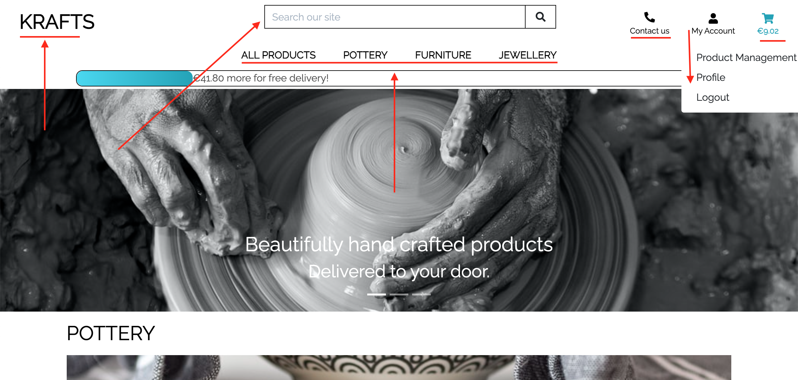|The Header is a multi-line element that conveys all services available to all users depending on their user status. It contains access links to all products of all categories, a search form, and links to all site pages not related to checkout.|
||Easily create an account|Purchase, rate, and comment on products|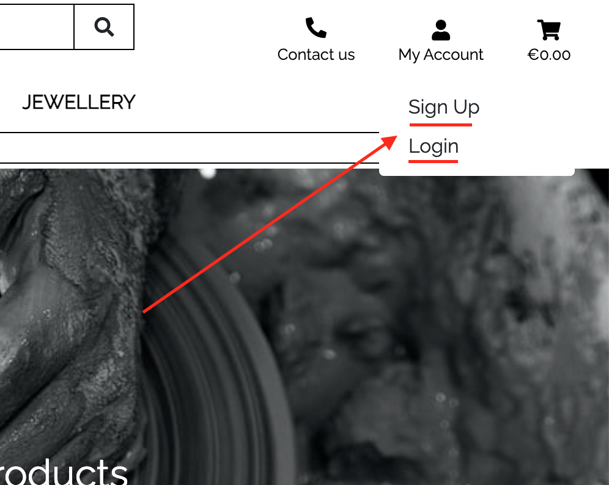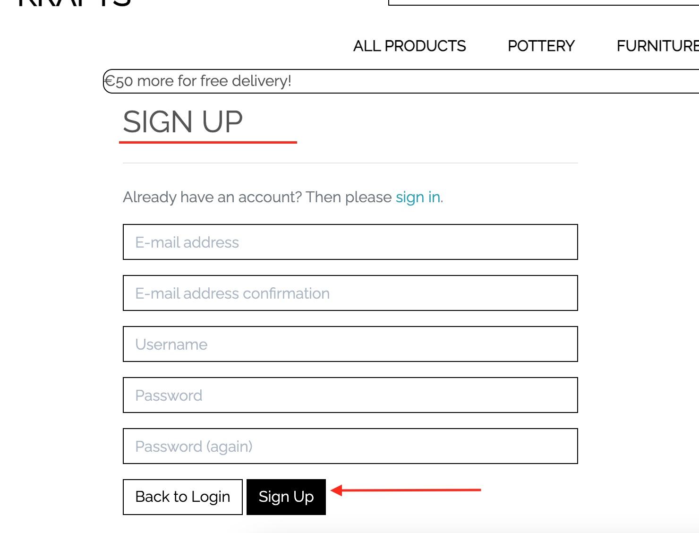|Sign Up and Login links are provided in the My Account tab which leads users to Sign Up or Login pages. Products can be added to the cart via both the Products page as well as the Product Details page. The ever present cart link leads directly to the Cart page from which users can go to a secure Checkout page from the click of a button. The Product Detail page contains a visual-based rating form, with ratings represtented by prominant star emojis. Directly under the rating form is a simple and intuitive comment form, the purose of which is immediately evident to the user.|
||Add items to my shopping cart prior to registration|Purchase products without committing to registering an account|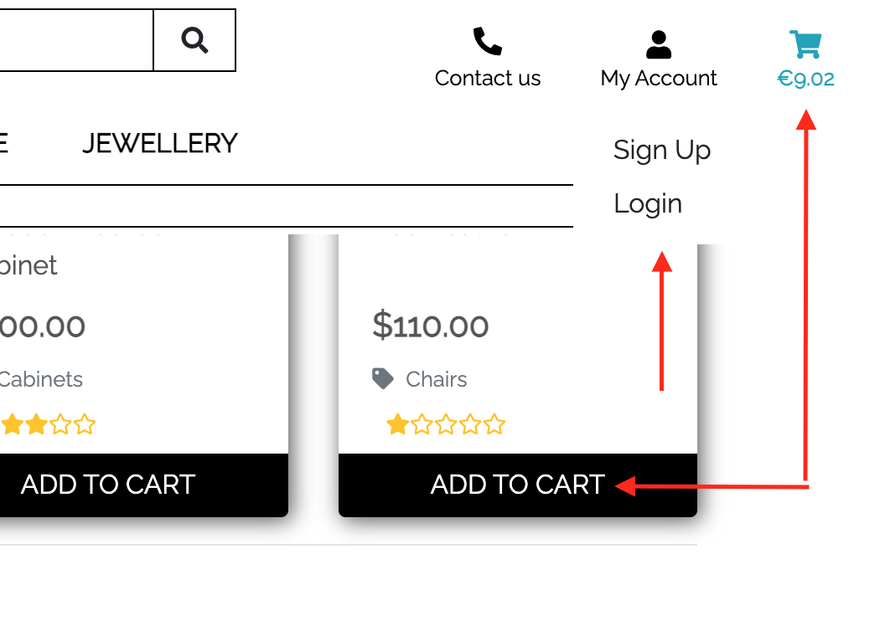|Any user can add products to their cart and securely purchase products. The Order model's UserProfile ForeignKey is optional, and therefore allows users who are not registered to purchase products.|
||Easily access product detail|Learn more about the product before purchase|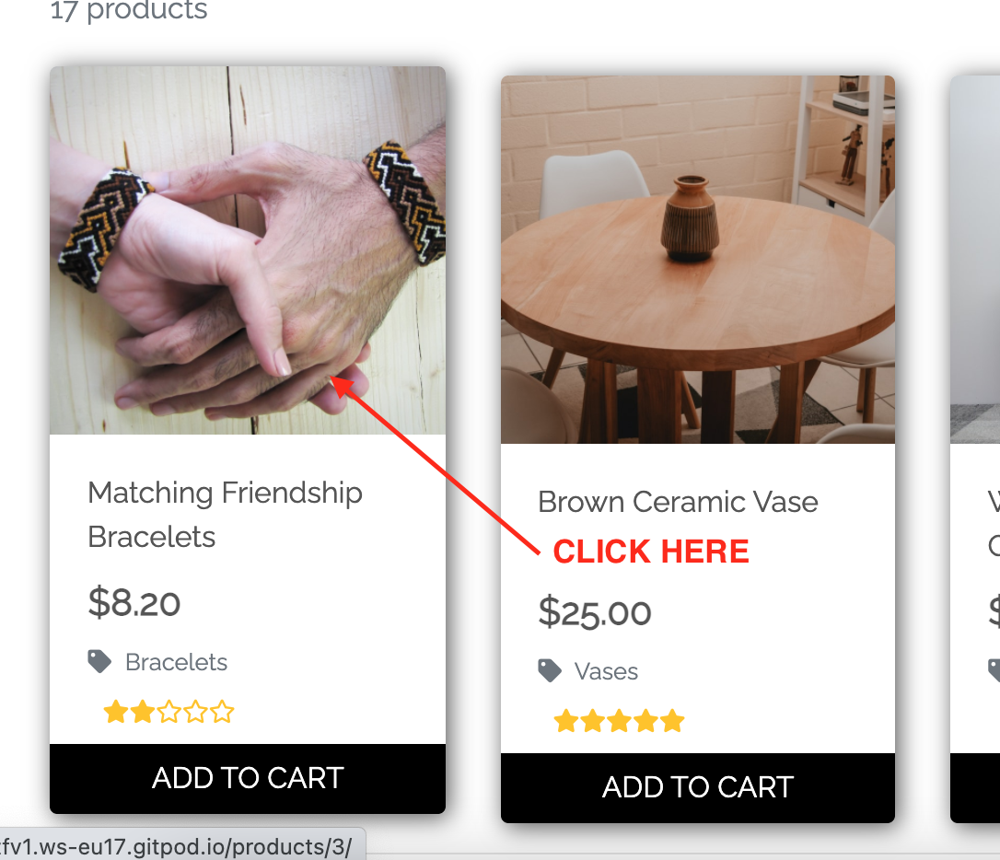|The Product Detail page of each product is easily and intuitively accessible via the respective product's card in the Product's page. The Product Detail page contains all customer-related information about the product in a simple and intuitive visual display.|
||Search for products using key words|Find specific products||Due to the sticky Header, the search form is always accessible to the user. The search form takes key words and returns all products with matching keywords in both the title and description to the Products page.|
||Filter by price|Find products within my price range|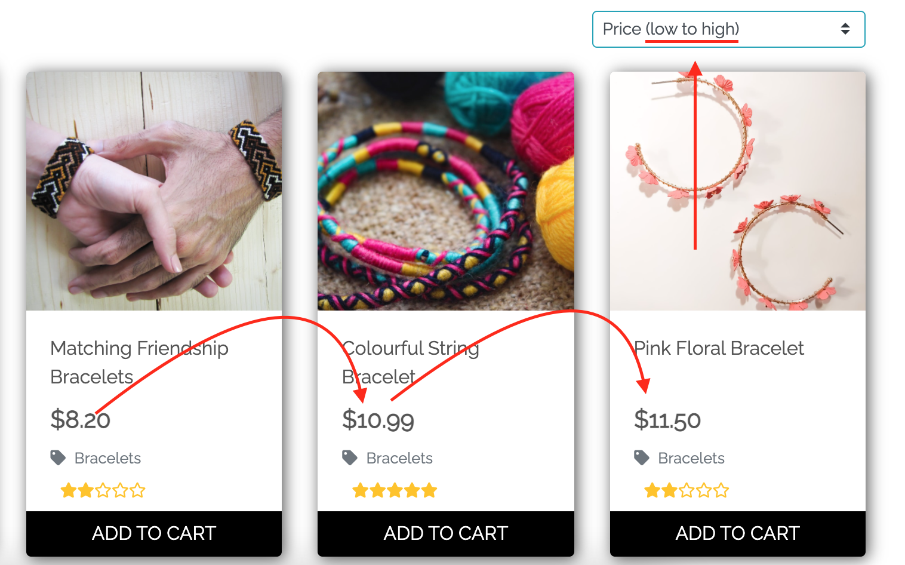|The Products page has a prominant filter selector box at the top of the products display. Using this filter selector box, users can filter products by price, from cheapest as well as from most expensive.|Filter by rating|See the popularity of the products|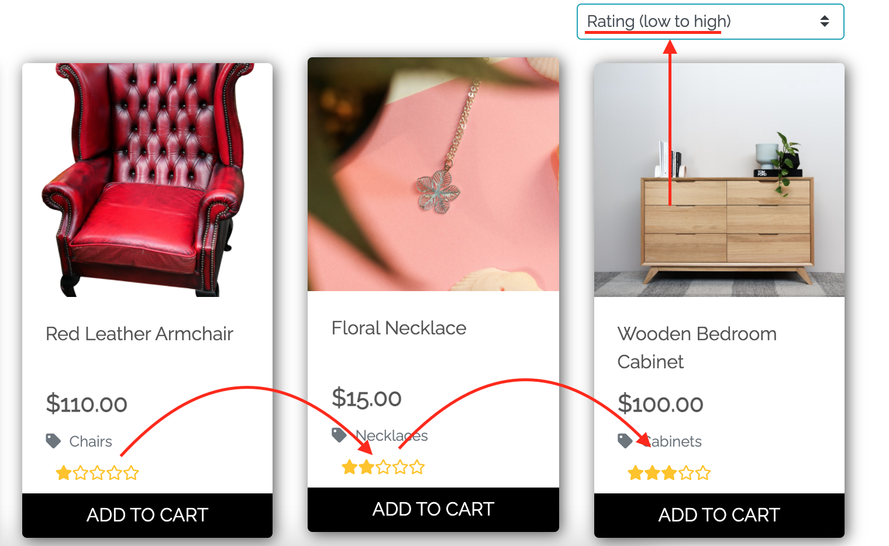|Users may also use the filter selector box to filter products by name, category, and rating - including in reverse order.|
||Read product comments/see ratings|Make an informed purchase decision||While commenting on products is only available to registered users, non registered users can easily access the comments section of the Product Detail page to see what other users are saying about a particular product. Each product's rating is visually represented by star emojis, both on the product's card element on the Products page, and on the product's Product Detail page. This image-led rating is designed to be maximally intuitive to the user. Equally, the rating form is also visually designed, with rating options represented by star emojis.|
|Registered user|Save my details|Checkout more easily for future purchases|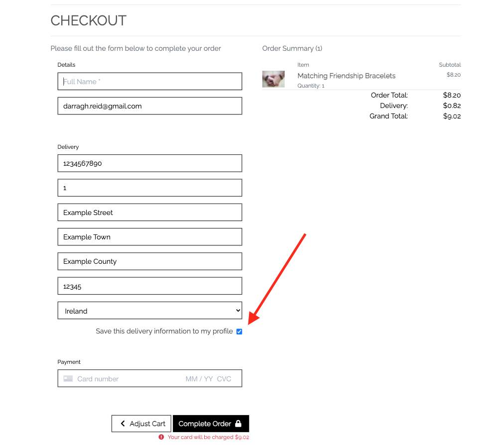|Users can access their Profile through the Account menu item in the Header. There, they will find a form immediately visible to them where they can add or update their details. This can also be done during checkout, by clicking the "Save this delivery information to my profile" checkbox. This ensures that their information is prepopulated for future checkouts|
||View my purchase history|Keep track of my purchases||A brief summary of each user's purchase history is available in a table format on their Profile page. A more detailed document of each purchase/order can be access via the Order Number link of each order on that table.|
||Comment on products|Express my opinion or inquire about different products||All registered users have access to a comments form on each product's Product Detail page. Intuitively designed, users need only write the comment, with the rest of the information prefilled and hidded, before being submitted to the Comments model. Only admins have the privilage of replying to comments. This ensures that the comments section remains appropriate to the purpose of the site.|
||Rate products|Express my opinion on different products|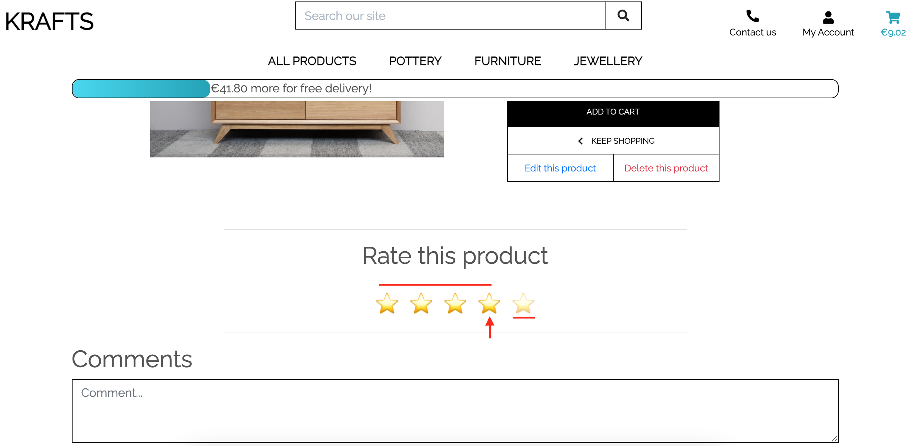|As previously discussed, comments can be rated easily through the intuitive rating form on the Product Detail page. Opinions on products can also be expressed via the comments form directly under the rating form.|
||Contact the site owner|Express concers and make inquiries|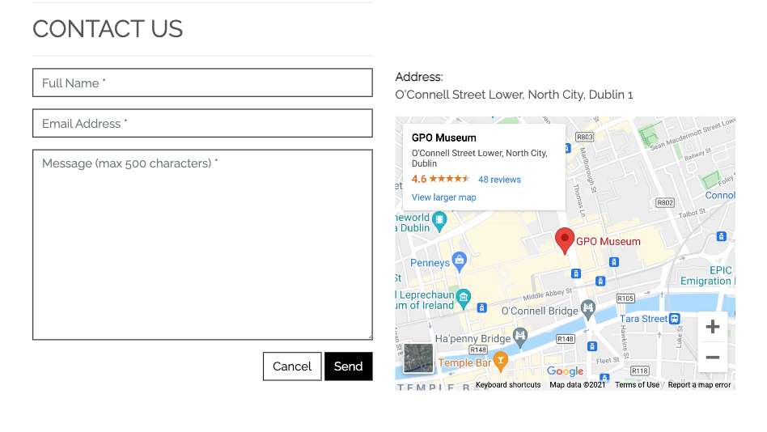|A link to the Contact page is prominantely displayed in the Header, next to the other nav items. The contact page features a contact form from which users can send emails directly to the site owner. The address of the company, as well as a visual Google Maps iframe provides an additional means of communication, and confidence in the company.|
||View my cart prior to checkout|review my order||The checkout page cannot be accessed directly. Users are first brought to the Shopping Cart where they can review their order, adjust the quantity of their items, and even remove items before proceeeding to checkout.|
||Receive confirmation of purchases|Keep account of my purchases||After each purchse, an email is sent an email confirming their order. Each customer can also access their order history in their Profile.|
||Easily know free delivery threshold|Know how much I need to spend to qualify for free delivery||Visual representation of the free delivery threshold is display is a progress bar in the Header. This progress bar gives visual and written feedback to the user about how much more they need to spend to qualify for free delivery.|
|Site owner|View, add, edit and delete all products|Rotate stock and keep stock up to date|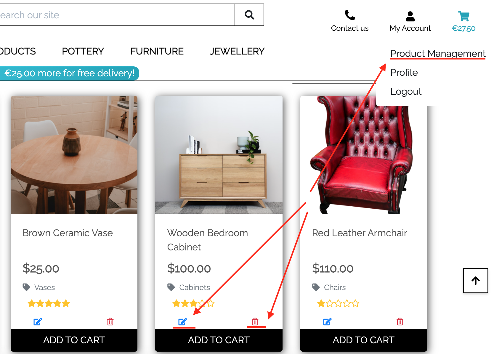|The site owner can upload products to the database by navigating to the Product Manage page via the account link in the Header. There the site owner will find a form to add products to the site. The site owner can also edit and delete products as they please via "Edit" and "Delete" buttons that are visible exclusively to admin in the product cards as well as in the Product Detail page.|
||Have an easy user experience|Manage my site without need for advanced computer skills||The site is intuitively designed for both customers and admins, with all potential actions prominantly visible to respective users.|
||Facilitate the needs of customers|Retain custom and engage with customers when needed||The ease of navigation is sure to provide a positive user experient to all customers. Customers are easily accommodated to explore, view and purchase products. They can also easily interact with products via rating and commenting, and can readily contact the site owner via the contact form.|

## Testing Features

### Features Available To All Users

[^ Back To Top ^](#Contents)

### HEADER
|**Feature**|**Test Description**|**Expected Restult/s**|**Image**|**PASS/FAIL**|**Comments**|
|:----|:----|:----|:----|:----|:----|
|HEADER|Toggle all dropdown menu items|All dropdown items should toggle their respective menu items|image|PASS||
||Click all links to to navigate to their correct respective destinations|All links lead to their correct destinations|image|PASS||
||Add a product to the cart|1. The cart icon should change colour||PASS||
|||2. The cart total should update by the price of the item||PASS||
|||3. The success toast should pop down from cart icon displaying a success message and cart summary||PASS||
|||4. The progress bar and free delivery delta should update in proportion to the price of the item||PASS|The progress bar occasionally collapses. If this happens, hard reload the page and it should reappear|
||Enter a key word into the search bar|Products with the key word in their description and/or name should be displayed on the Products page|image|PASS||

[^ Back To Top ^](#Contents)

### HOME PAGE
|**Feature**|**Test Description**|**Expected Restult/s**|**Image**|**PASS/FAIL**|**Comments**|
|:----|:----|:----|:----|:----|:----|
|HOME PAGE|Observer the carousel|1. The carousel should auto slide||PASS||
|||2. The carousel can be controled by clicking the navigation bars at the bottom||PASS||
|||3. The correct text and images are displayed||PASS||
||Click each image-based category link to navigate to their respective destinations|The category links should lead to their correct destinations||PASS||
||Scroll to the bottom of the page|The category links should have a parallex effect||PASS||
|FOOTER|Click all links in the footer to navigate to their respective destinations|All links lead to their correct destinations||PASS|Depending on screen size, footer may appear to float. This is documented in the Remaining Bugs section of this file.|

[^ Back To Top ^](#Contents)

### PRODUCTS PAGE
|**Feature**|**Test Description**|**Expected Restult/s**|**Image**|**PASS/FAIL**|**Comments**|
|:----|:----|:----|:----|:----|:----|
|PRODUCTS PAGE|Observe the page on larger screens|1. The product cards should be displayed in rows of 4||PASS||
|||2. The side nav should be visible and fixed||PASS||
|||3. The filter selector box should appear in the top right of the products container||PASS||
|||4. A link to the home page, followed by a search results count should appear on the top left of the products container||PASS||
||Toggle the filter selector box|The selector box should drop down the correct sorting options||PASS||
||Click each sorting option in the selector box|Appropriately filtered products in the correct order should be displayed in the products container||PASS||
||Click each category in the side nav|1. All subcategories of clicked category should be highlighted in the side nav||PASS||
|||2. All products in the clicked category should be displayed in the products container||PASS||
||Click each subcategory in the side nav|1. The subcategory should be highlighted in the side nav||PASS||
|||2. All products in the subcategory should appear in the products container||PASS||
||Observer the product cards|1. Each card should display an its own image/default image, name, price, category, and star rating||PASS||
|||2. Each card should contain an "Add To Cart" button||PASS||
|||3. Each card should contain "Edit" and "Delete" icons for admin users only||PASS||
||Click the "Add To Cart" button of any product.|The product should be added to the cart||PASS||
||Click the "Edit" icon of any product to navigate to the Edit Product Page.|The "Edit" icon should lead to the Edit Product page||PASS||
||Click the "Delete" icon of any product.|A modal requesting confirmation of deletion should appear||PASS||
||Click the "Delete" button of the modal.|The product should be deleted and a success confirmation toast should be displayed under the cart icon||PASS||
||Observe the page on medium screen|The product cards should be displayed in rows of 2 or 3.||PASS||
||Observe the page on small screen|1. The product cards should be stacked vertically.||PASS||
|||2. The filter selector box should appear at the top of the products container, with the search result count displayed directly beneath it||PASS||

[^ Back To Top ^](#Contents)

### PRODUCT DETAIL PAGE
|**Feature**|**Test Description**|**Expected Restult/s**|**Image**|**PASS/FAIL**|**Comments**|
|:----|:----|:----|:----|:----|:----|
|PRODUCT DETAIL PAGE|Observe the Product Detail page of any particular product on medium and larger screens|1. The product image and product details & actions should appear inline in two columns||PASS||
|||2. The product deatails column should includ the product's name, price, category, rating (represented by stars/"no rating" if the product has received any ratings), and description||PASS||
|||3. An input form to ajust the quantity of the product should appear directly under the product description||PASS||
|||4. "Add To Cart" and "Keep Shopping" buttons should appear directly under the quantity input form, stacked virtically||PASS||
|||3. "Edit This Product" and "Delete" this product should be displayed directly under the "Add To Cart" and "Keep Shopping" buttons only to admin users||PASS||
|||4. A rating form, with inputs represented by stars, will be displayed directly under the row containing the product image and product details & actions buttons||PASS||
|||5. The message "You have already rated this product" should appear in place of this form if the user has already rated this product"||PASS||
|||6. A message instructing the user to sign in in order to to rate the product should appear in place of this form, should the user not be logged in.||PASS||
|||7. A comment form with one input for users to write a comment, along "Cancel" and "Post" buttons beneath, should appear directly under the rating form.||PASS||
|||8. A message instructing the user to sign in in order to comment on the product appear in place of the comment form, should the user not be loggin in||PASS||
|||9. A comments section displaying all comments made about the product should appear directly under the comment form||PASS||
|||10. Each comment should display the author's name, date and time of posting, as well as the comment itself||PASS||
|||11. "Edit" and "Delete" buttons should appear in the top right of the comment if the user is also the author of the comment||PASS||
|||12. A "Reply" button should appear at the bottom of the comment only to admin users.||PASS||
|||13. Replies by admin users are nested and indented beneath the comments they are in reply to.||PASS||
|||14. A message encouraging the user to be the first to comment on the product should appear in place of the comments section, should there not be any comments to display||PASS||
||Observe the Product Detail page of any particular product on smaller screens|The product image and product details & actions should appear stacked virtically||PASS||
||Change the product quantity by clicking the increment and decrement buttons on the of the input form|1. The quantity should not go below one, or above 99.||PASS| This has stopped working|
||Change the product quantity to an invalid number by manually typing a specific quantity into the input box. Then attempt to add the product to the cart.|An error message should appear indicating the proper value range for the product.||PASS||
||Add the product to the cart|1. A success toast should appear indicating that the product has been successfully added to the cart, with the cart summary below including the product that has just been added||PASS||
||Rate the product by clicking of the stars in the rating form|1. The stars' opacity should change on hover||PASS||
|||2. The product should appear in the cart||PASS||
|||2. A success toast should appear informing the user they have successfully rated the product||PASS||
|||3. The product's rating should be updated by the amount the user has rated it by||PASS||
|||4. The product's average rating should be adjusted appropriatly||PASS||
|||5. The rating form should be replaced by a message indicating the user has already rated the product||PASS||
||Comment on the product|1. A success message informing the user that they have successfully commented on the product should appear in a success toast||PASS||
|||2. The comment should appear at the top of the comment form as it should be the most recent comment||PASS||
||Click the "Edit" button on the comment|An edit comment form should appear directly below the comment being edited.||PASS||
||Edit the comment|1. A success toast should appear indicated that the comment has been successfully edited||PASS||
||Edit the comment|The edited comment should appear at the top of the comments section||PASS||
||Click the "Delete" button of the comment to delete it.|1. A success toast should appear indicating the comment has been successfully deleted||PASS||
|||2. The comment should be removed from the comments section||PASS||
||Click the reply button of any comment|A reply form should appear directly beneath the comment being replied to||PASS||
||Reply to the comment|1. A success toast should appear indicating that the reply has successfully been posted||PASS||
|||2. The reply should be nested and indented beneath the comments that has been replied to||PASS||

[^ Back To Top ^](#Contents)

### CART
|**Feature**|**Test Description**|**Expected Restult/s**|**Image**|**PASS/FAIL**|**Comments**|
|:----|:----|:----|:----|:----|:----|
|CART|Observe the Shopping Cart Page on large and medium screens|The products should be displayed in a tables, with the cart total, delivery information, grand total, and Keep Shopping & Secure checkout buttons displayed beneath||Pass||
||Observe the table|The table should organise the products into 4 columns; Product Info for product image, name & sku, Price for product price, Quantity for a quantity input form displaying current product quantity and a means to adjust it, and Subtotal which displays the subtotal for a particular product ||PASS||
||Change the product quantity by clicking the increment and decrement buttons on the of the input form|1. The quantity should not go below one, or above 99.||PASS||
||Change the product quantity to an invalid number by manually typing a specific quantity into the input box and clicking "Update".|An error message should appear indicating the proper value range for the product.||PASS|This has stopped working|
||Click the "Remove" button of any cart item|1. A success toast indicating that the item has been successfully removed should appear||PASS||
|||2. The item should be removed from the cart||PASS||
||Click the "Keep Shopping" and "Secure Checkout buttons to verify that they lead to their correact respective destinations|The "Keep Shopping" and "Secure Checkout" buttons should lead to their correct destinations||PASS||

[^ Back To Top ^](#Contents)

### PRODUCT MANAGEMENT PAGE
|**Feature**|**Test Description**|**Expected Restult/s**|**Image**|**PASS/FAIL**|**Comments**|
|:----|:----|:----|:----|:----|:----|
|PRODUCT MANAGEMENT PAGE: Add|Observe the Product Management page for adding a product|The Add A Product form should be correcly formatted, with the correct fields displayed appropriately, required fields marked, any the the appropriate fields autofilled.||PASS||
||Add a product|1. A success toast should appear indicating that the product has been successfully added.||PASS||
|||2. The product's individual Product Detail page should be redirected to||PASS||
|Add a product with invalid details||1. The form should not submit||PASS||
|||2. A tooltip should appear instructing to fill in any required field that was left blank||PASS||
|||3. In the case of invalid information being input, an error toast should appear indicating that adding the product had failed, and instructing to check that the form is valid||PASS||
|PRODUCT MANAGEMENT PAGE: Edit|Observe the Product Management page for editing a product|1. The form should be autofilled with the details of the product being editd||PASS||
|||2. An information toast should appear indicating which product is being edited||PASS||
||Edit the product|1. The product's Product Detail page should be redirected to||PASS||
|||2. A success toast should appear indicating that the product has been successfully updated.||PASS||
|||3. The update made to the product should appear in the product's details.||PASS||

[^ Back To Top ^](#Contents)

### PROFILE PAGE
|**Feature**|**Test Description**|**Expected Restult/s**|**Image**|**PASS/FAIL**|**Comments**|
|:----|:----|:----|:----|:----|:----|
|PROFILE PAGE|Observe the Profile page of an empty profile.|1. The Default Delivery Information form should be correctly rendered and empty.||PASS||
|||2. The Order History table is empty ||PASS||
|||3. The Default Delivery form and Order History table are displayed inline on larger and medium screen, and stacked vertically on smaller screens. ||PASS||
||Make an order and check the "Save Delivery Information checkbox|The profile Default Delivery Information form should be pre-filled with the delivery details provided during checkout||PASS||
||Edit the Default Delivery form and submit|A success toast should appear indicating that the profile has been updated successfully||PASS||
||Observe the Profile page of a profile with saved information and an order history.|1. The Default Delivery Information form should be correctly rendered and pre-filled.||PASS||
|||2. The Order History table displayed past orders in the correct format.||PASS||

[^ Back To Top ^](#Contents)

### CHECKOUT PAGE
|**Feature**|**Test Description**|**Expected Restult/s**|**Image**|**PASS/FAIL**|**Comments**|
|:----|:----|:----|:----|:----|:----|
|CHECKOUT PAGE|Observe the checkout page with an empty profile|1. The checkout form should render empty||PASS||
|||2. The order summary should display the product image, name, quantity, subtotal, along witht the order total, delivery cost (if any) and the grand total.||PASS||
|||3. The order summary and checkout form should be displayed inline on medium and large screen, and stacked vertically on smaller screens.||PASS||
||Submit a valid order|1. A success toast should appear indicating that the order has been successfully places, display the order number, and inform that a confirmation email has been sent to the email entered during checkout||PASS||
|||2. The page should redirect to the Checkout Success page||PASS||
|||3. A confirmation email should be sent to the email provided in the checkout form||PASS||
||Submit an invalid order|1. A tootip should indicate if a field has been left black||PASS||
|||2. An incorrect card number should show up in red, with a message below the card number input indicating that the card details are invalid.||PASS||

[^ Back To Top ^](#Contents)

### CHECKOUT SUCCESS PAGE
|**Feature**|**Test Description**|**Expected Restult/s**|**Image**|**PASS/FAIL**|**Comments**|
|:----|:----|:----|:----|:----|:----|
|CHECKOUT SUCCESS PAGE|Observe the Checkout Success page|1. A thank you message followed by a messesage indicating that a confirmation email has been sent to the email provided durint checkout||PASS||
|||2. An order summary containing all of the appropriate order details is displayed, followed by a "Back To Shop" button||PASS||
||Click the "Back To Shop" button to navigate to the Products page|The "Back To Shop" button should navigate to the Products page||PASS||

[^ Back To Top ^](#Contents)

### ORDER HISTORY PAGE
|**Feature**|**Test Description**|**Expected Restult/s**|**Image**|**PASS/FAIL**|**Comments**|
|:----|:----|:----|:----|:----|:----|
|ORDER HISTORY PAGE|Observe the Order History page|It should be a replica of the Checkout Success page of the particular order that was clicked||PASS||

[^ Back To Top ^](#Contents)

### SIGN IN PAGE
|**Feature**|**Test Description**|**Expected Restult/s**|**Image**|**PASS/FAIL**|**Comments**|
|:----|:----|:----|:----|:----|:----|
|SIGN IN PAGE|Observe the Sign In page|1. The sign in form should be correctly rendered with all the correct fields displayed, including a "Remember Me" checkbox.||PASS||
|||2. "Sign In" and "Home" buttons should appear below the form||PASS||
|||3. A "Forgot password" link should appear below the "Sign In" and "Home" buttons||PASS||
|||4. A link to sign up should appear above the form||PASS||
||Click the sign up link to navigate to the Sign Up form|The link should navigate to the Sign Up form||PASS||
||Click the "Forgot password?" link|The link should navigate to the Password Reset form||PASS||
||Sign into an account|The page should redirect to the Home Page||PASS||
||Enter invalid information into the Sign In form|An error indicating that an incorrect username and/or password has been entered||PASS||

[^ Back To Top ^](#Contents)

### SIGN UP PAGE
|**Feature**|**Test Description**|**Expected Restult/s**|**Image**|**PASS/FAIL**|**Comments**|
|:----|:----|:----|:----|:----|:----|
|SIGN UP PAGE|Observe the Sign Up page|1. The sign up form should be correctly rendered with all the correct fields displayed.||PASS||
|||2. "Sign Up" and "Back To Login" buttons should appear below the form||PASS||
|||4. A link to Sign In should appear above the form||PASS||
||Click the Sign In link to navigate to the Sign In form|The link should navigate to the Sign In form||PASS||
||Click the "Back To Login" button|The button should navigate to the Sign In form||PASS||
||Register an account|The page should redirect to the Accounts page where it is indicated that an email from which the user can verify their account has been sent to the email provided during registration||PASS||
||Enter invalid information into the Sign Up form|An error indicating that an incorrect username and/or password has been entered||PASS||

[^ Back To Top ^](#Contents)

### VERYIFY ACCOUNT PAGE
|**Feature**|**Test Description**|**Expected Restult/s**|**Image**|**PASS/FAIL**|**Comments**|
|:----|:----|:----|:----|:----|:----|
|VERIFY ACCOUNT|Observe the accounts/confirm email page|A message instructing to press the confirm button to verify the email provided during registration should be visible||PASS||
||Click the "Confirm" button|1. The page should be redirected to the Sign In page||PASS||
|||2. A success toast should appear indicating that the email has been confirmed||PASS||

## Site Responsiveness

[JustJokes](http://just-jokes.herokuapp.com/get_jokes) was tested across a range of devices and internet browsers to assess the responsiveness of the site. The site was also tested on all available devices in Google Dev Tools to ensure it was visually appropriate on all screen sizes.

The site was tested on the following devices: 

* MacBook Pro (Retina, 13-inch, Early 2015)
* iPhone 8 Plus
* Samsung Galaxy S10
* Huawei LYO-L01
* Windows 10(desktop)
* iPad Air

And on the following browsers: 

* Google Chrome 
* Safari 
* Opera 
* Samsung Internet

## User Testing

The site was tested by various peers and family members throughout the building process. Known bug were confirmed and some new ones pointed out. Appreciation was expressed for the functionality of the site.

## Known Bugs and Issues
* When trying to implement a search engine for jokes, I would get the following error: 'Cursor' has no len()
I realised that I had to convert the jokes retrieved from the database to a list using list()

* Upon implementing the Bootstrap modal on each card element to display the full joke, I discovered that, no matter what card was selected, the modal would always display the joke of the first card (which was the chicken joke). I tried various methods to rectify this.

    I started by setting the id of the modal and the data-target of the Expand button, to the joke id ( {{joke._id}} ). I thought this would help as I assumed that the problem stemmed from each modal having an identical ID. However, this did not work.

    I then attempted to rectify the issue by using variables inside the jinga for loop. I wrote  and used these variables in the both the modal and card to ensure that both the modal and card details would always be the same. Unfortunately, this produced the same result.

    To examine the problem further, I used the JavaScript and the chrome console to see if I could spot the problem. Interestingly, when I used JavaScript to console.log() the contents of both card and modal, the text of both the card and the modal were always identical.

    I didn’t understand why the modal presented to the user displayed different information to what was printed to the console.

    I then used JavaScript to set the innerHTML of the modal elements to the innerHTML of the card elements. Again, everything was displaying fine on the console, but not on the modal on the screen.

    To my surprise, when I built my own modal from scratch, the same problem occurred! Each modal would still display the text from the first joke, no matter what joke had been selected.

    The next step I took was to insert an onclick event listener directly into the button element that triggered the modal. It called the displayModal() function I had created before, but I passed in the jinja values from the for-loop. When I assigned the values of the modal to the values of the jinja values, and logged them to the console, I saw that the chicken joke would log to the console perfectly. Every other joke would get the error: “Uncaught SyntaxError: Invalid or unexpected token”

    I then thought the problem then lay with the jokes themselves. Upon inspection in MongoDB, the chicken joke was the only joke that was written on one line. I edited the fish joke to ensure it was also all on one line. When I refreshed the page, the fish joke logged to the console and was successfully inserted into the modal.

    I then reinstated the Bootstrap modal to see if it would work on the newly formatted jokes. Alas, it had the same issues as before. Only the chicken joke was displayed on the modal, no matter what card was clicked.

    I decided I would combine the Bootstrap modal with my onclick function, to see if I could could pass the card’s jinja values into the modal. This worked with the jokes that had been reformatted in MongoDB. However, if an unformatted joke was clicked, the modal would display the last correctly formatted joke that had been clicked.

    I decided that I would include a note for the user in the Add Joke form, telling them to ensure that their joke is one line only. This is a remaining bug that will have to be addressed in future versions.

    Just when I thought I was done with the problem, after I created the “add to favourites” functionality, I discovered that modals of the favourited jokes were not displaying any information other than the user who posted the joke. I speculated that the cause could be the duplication of ids on the "jokes" for loop and "fav_jokes" for loop on the one profile page.

    After addressing that, our friend, the chicken, once again appeared on every modal, and only the title. I went about changing the names of the "fav_jokes" modal classes and updating the displayModal() function to target them as well as the "jokes" modal classes. The problem was solved. 

* Another major problem I had occurred after I had implemented the age restrictions. I changed the names and ages of two accounts I had created to reflect an over 18 user and and under 18 user, for testing purposes. When trying to log back in with these user details (I hadn’t changed passwords) I was greeted with errors. 

    I manually typed in the url for the sign up page and created a new account for an adult. When I was logged in, everything was displaying correctly. I attempted to add a few jokes to my favourites. The first 4 went fine, until I got to the 5th where I got an error: “TypeError: 'NoneType' object is not subscriptable”. 

    I pressed the back arrow and went to my profile. The jokes that seemed to be successfully favourited were not in my profile. I tried to favourite them again. I started with the first 4 and each time the flash said “joke already favourited”. I tried with the next few and got the same errors as before. I saw that the jokes that didn’t caused the error were all in the database (under the previous account I had been using, under the old name). 

    The variables in the add_fav() view must have been read, otherwise the flash telling me that the jokes has already been favourited would not be displayed. I noticed that the joke_teller and joke_favouriter of these jokes were the two accounts whose details I changed. I changed the usernames back and was able to log in with them. 

    However, the problem remained. Getting more familiar with how to problem solve, I printed the values of both "joke" and "already_favd" variables to see which one was giving the error. I realised that already_favd was None because it didn’t exist in the database at the time of favouriting. Although, this wasn’t a problem when I first wrote the code and was adding jokes into the user_favourites collection. Nonetheless, I changed my if statements from 'if jokes[“joke_description”] ==  already_favd[“joke_description”]' to 'if already_favd', and the system was back working.

* Another issue occurred when I implemented the “like” functionality. I wanted to ensure that users could only like a joke once. Thinking this would be a quick feature to implement, I created two like buttons for each card. One would display if the user hadn’t liked the joke, and the other would be hidden. If the user liked the joke, the like would be recorded in the database and a JavaScript function would swap the buttons. If the second button was pressed, the like would be removed from the database the the JS function would swap the buttons back.

* This didn’t work. I spent a long time trying to figure out why, redesigning the functions, redoing the HTML, etc. When logging the event listeners of the buttons to the console, nothing was showing up. I changed the event listener to be on the document, rather than on the buttons, and set the event.target.classname to the buttons.

* This proved slightly more useful, as the event would log to the console, but only for a split second. I realised this was because of the "redirect" return statement in the like_joke() view in app.py. It reloaded the page every time the like button was clicked. I supposed that the script.js function didn’t have time to carry out its functionality before the page was loaded. I decided to redesign by like_joke() view and simply inform users if they had already liked the joke. Eventually, it was redesigned again to its current state, where pressing the "Like" button a second time would reverse the "liking" process.

* I had initially designed the add_fav() view to add the joke, along with the user’s name as an identifier, to a new collection named “user_favourites”. This system seemed to be working fine while I continued building the project. However, upon logging in under another user, I realised that this would just add multiple versions of the same joke to the collection, each with its own “favouriter”. This resulted in the user being told they had already liked the joke, when they hadn’t. 

    I had since created the like_joke() view with a more effective method, by adding a “liked_by” field to the jokes collection, which was an array of users who had liked the joke. So, I decided to re-do the add_fav() view using a similar method. This turned out to be a bigger undertaking than expected, and resulted in me having to update several other functions accordingly.

* Calculating the user’s age proved to be a major challenge. I painstakingly designed my own method of calculating wether the user was over 18 or not. It didn’t work effectively. Then, I discovered datetime, and the rest is history!

* Another issue I was having was passing variables between views. I couldn’t seem to call views inside other views to get their values. One particular value that I needed in multiple views was the user’s age. I decided to created an external function with no decorators that only returned the user’s age. I was able to call this function and assign it to variables inside other functions to access the user’s age.

* Implementing age restrictions was another task that proved bigger than expected, and multiple other views had to be updated to accommodate it

    Implementing the age restrictions caused errors, also. For example, jinja if statements had to be modified because they were now causing errors if there was no user in session. This is because the age restriction were based off the user’s age. If there was no user, the if statements (eg: if user.age >= 18) would cause errors.

* A big bug arose while validating my code. When put through the validator, 85 errors appeared concerning duplicate IDs. I went through the code and gave new names to the data-targets and corresponding modal IDs to ensure each one was unique. This didn’t rectify the issue. I then realised the issue came from the fact that there were multiple cards on the html page, rather than any issues with my code.

I went about adding the joke id to each of the data targets and corresponding modal IDs with jinja, like I had done earlier in the project (as mentioned above). This resulted in the modals not working. Upon inspection in Chrome, I could see that the data targets and ids were perfectly fine, but the modals were still not displaying. 

After a considerable amount of time experimenting with the code, I found that, even though the jinja joke IDs were displaying on the html, the modals would not respond. I would even copy and paste the jinja IDs directly from the dev tools and paste it into my own code. If I did this, it would work. However, I obviously could not do this for every joke on the webpage.

A friend suggested I move the modals outside of the for loop. This way, there would only be one modal and I would not have to worry about duplicate ids. This worked fantastic for the expand modal, which displayed the full joke. However, when it came to the delete modal, more time consuming issues arose. 
    
Nothing would display on the modals. A separate onclick function was written for the delete modal, almost identical to the one for the expand function, with the additional parameter of “id”. “Id” was for the url_for "href" that passed the joke id to python for it to be deleted.

Nothing would display on the modal, however, only the “posted by”, which seemed to display whether I inserted it into the modal or not. The HTML message that was written jokes.html would also display. I tried creating the elements within the Javascript. I created all the h and p elements needed, appended the correct content, and then inserted them into the modal. This worked. However, it would duplicate the code every time I would click the delete icon. After three clicks, there would be three jokes displayed on the modal, etc.

After much experimenting, I decided to move it back to its original position in the for loop, only to find that it was displaying incorrect information. It was just displaying the joke title multiple times, instead of the other details. 
    
I moved it back outside the loop and decided that I didn’t need to display the joke on the modal. I only needed the confirmation message and include the delete button. I redesigned the javascript function to take in the joke's id, create the url_for('delete_joke') href, and insert it into the modal. Again, it looked fine on dev tools, but would lead to a 404 error. 

The see full jokes were working fine outside the loop, so I decided to move the delete modals back inside the loop, again. However, this time I kept them outside of the card, but still inside the loop. Before they had been placed directly under the button that triggered. Then, I removed the onclick functions and reinstated all the jinja variables. I also put {{joke._id}} back as the data-target of the button and matching modal ID. Finally, the bug was solved.

Modals and chickens are now my enemies.

## Remaining Bugs and Issues
* With the project now complete, I can see I could have reduced both my HTML and Python code by writing my views more efficiently. For example, in get_jokes():

    if user >= 18:
        jokes = mongo.db.jokes.find()
    elif user < 18:
        jokes = mongo.db.jokes.find({for_children: "on"})

    Would have saved me writing so much HTML code, and shortened the get_jokes() view itself.

    That said, the code that I have written works. Future versions will have more condensed code.

* As mentioned above, jokes that are not uploaded to the database on one line, don't display correctly on the modals. While I find a fix for this, users are asked to upload jokes on one line, only.

* The reloading of the pages after clicking the "Like" or "Add to favourites" buttons isn't great user experience. It leads to users having to scroll back to where they previously were. Future versions would ensure the page doesn't reload when clicking joke action buttons.

* Currently the calendar in the sign up form will submit without a value. This could potentially be a problem as the age restriction aspect of this site is very central to the code. Future versions would find a better alternative to this calendar.